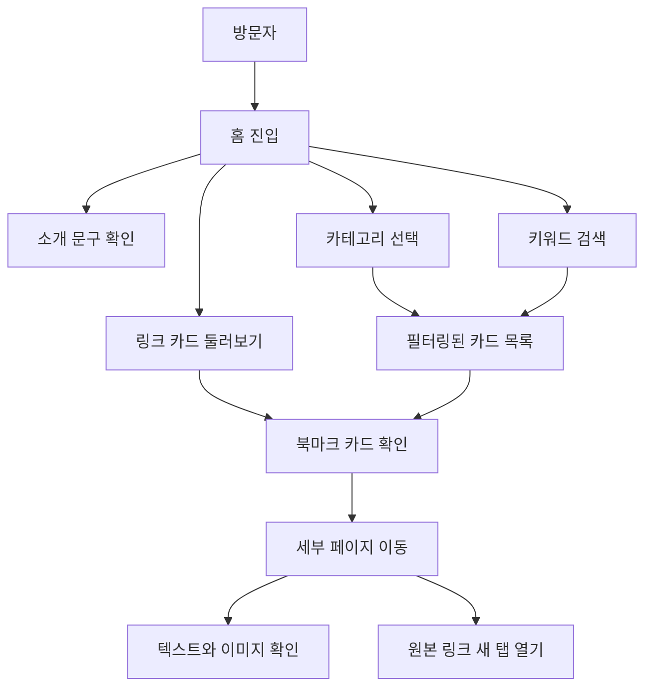

# 감성 북마크 사이트 PRD

## 1. 제품 개요

감성 북마크 사이트는 사이트 소유자가 좋아하는 웹페이지, 글, 도구, 디자인 레퍼런스, 장소, 음악 등을 큐레이션해 방문자에게 보여주는 공개형 링크 아카이브다.

첫 버전은 정적 데이터 기반으로 운영한다. 관리 화면이나 회원 기능 없이, 미리 정의한 링크 데이터를 카드 형태로 보여주고 방문자가 카테고리 필터와 검색으로 원하는 링크를 탐색할 수 있게 한다. 각 북마크 카드는 내부 세부 페이지로 연결되며, 세부 페이지의 본문은 사이트 소유자가 직접 텍스트와 이미지를 하드코딩한다.

## 2. 배경과 문제

좋은 링크는 저장하기 쉽지만, 시간이 지나면 왜 저장했는지와 어떤 맥락에서 좋았는지가 흐려진다. 일반 북마크 목록은 URL 중심이라 취향과 설명이 잘 드러나지 않고, 공개적으로 공유하기에도 건조하다.

이 제품은 링크 자체보다 “이 사람이 왜 이 링크를 좋아했는지”를 보여주는 데 집중한다. 방문자는 단순한 URL 모음이 아니라 개인의 취향이 정리된 작은 스크랩북을 둘러보는 경험을 한다.

## 3. 목표

- 방문자가 사이트 성격을 5초 안에 이해할 수 있게 한다.
- 링크마다 제목, 설명, 개인 메모, 태그를 제공해 큐레이션 맥락을 전달한다.
- 북마크 카드에서 세부 페이지로 이동해 더 긴 설명과 이미지를 볼 수 있게 한다.
- 카테고리 필터와 검색으로 관심 있는 링크를 빠르게 찾게 한다.
- 손글씨 노트와 스크랩북 느낌의 시각 언어로 따뜻하고 개인적인 분위기를 만든다.
- 이후 링크 추가 기능이나 자동 메타데이터 수집으로 확장할 수 있는 콘텐츠 구조를 준비한다.

## 4. 비목표

- 첫 버전에서는 로그인, 회원가입, 저장소 동기화, 커뮤니티 기능을 제공하지 않는다.
- 첫 버전에서는 브라우저에서 링크를 추가하거나 수정하는 관리 화면을 제공하지 않는다.
- 첫 버전에서는 URL 입력만으로 제목, 설명, 썸네일을 자동 수집하지 않는다.
- 첫 버전에서는 댓글, 좋아요, 공유 카운트 같은 소셜 기능을 제공하지 않는다.
- 첫 버전에서는 세부 페이지 본문을 CMS나 마크다운 파이프라인으로 관리하지 않고, 페이지 코드 안에 직접 작성한다.

## 5. 대상 사용자

### 사이트 방문자

소유자의 취향이 담긴 링크를 둘러보고, 흥미로운 글이나 도구를 발견하려는 사람이다. 포트폴리오 방문자, 친구, 동료, SNS를 통해 유입된 사람이 포함된다.

### 사이트 소유자

직접 선별한 링크를 공개적으로 보여주고 싶은 사람이다. 첫 버전에서는 코드나 정적 데이터 파일을 수정해 링크 목록을 관리한다.

## 6. 핵심 가치

- 취향이 보이는 큐레이션: 링크 카드마다 개인 메모와 태그를 함께 보여준다.
- 탐색의 즐거움: 카드형 레이아웃, 손글씨 장식, 스티커 같은 태그로 둘러보는 재미를 만든다.
- 다시 찾기 쉬움: 카테고리 필터와 키워드 검색으로 북마크 아카이브의 실용성을 확보한다.
- 가벼운 운영: 데이터는 정적으로 관리해 배포와 유지보수를 단순하게 유지한다.

## 7. 첫 버전 사용자 흐름

## 8. 화면 구성

### 홈

- 손글씨 스타일의 사이트 제목을 보여준다.
- 한두 문장으로 사이트의 의도를 설명한다.
- 추천 링크 또는 최근 저장한 링크를 강조할 수 있다.
- 검색창과 카테고리 필터를 링크 목록 상단에 배치한다.

### 링크 목록

- 링크를 카드 그리드로 보여준다.
- 각 카드는 썸네일, 제목, 설명, 개인 메모, 태그, 저장일을 포함한다.
- 카드를 클릭하면 해당 북마크의 내부 세부 페이지로 이동한다.
- 추천 링크는 작은 스티커나 손그림 별표로 표시한다.

### 세부 페이지

- 노션의 일반 페이지처럼 제목, 커버 이미지, 본문 텍스트, 이미지 블록을 위에서 아래로 읽는 구조를 사용한다.
- 세부 페이지 본문은 사이트 소유자가 직접 하드코딩한다.
- 원본 URL은 세부 페이지 안에서 별도 버튼이나 링크로 제공하고 새 탭으로 연다.
- 홈 또는 목록으로 돌아가는 링크를 제공한다.

### 빈 상태

- 검색이나 필터 결과가 없을 때 “아직 이 서랍에는 아무것도 없어요”처럼 사이트 톤에 맞는 문구를 보여준다.
- 전체 링크 보기로 돌아가는 액션을 제공한다.

## 9. MVP 기능

### 정적 링크 데이터 표시

정의된 링크 데이터를 읽어 카드 목록으로 렌더링한다. 링크 데이터는 제목, URL, 설명, 카테고리, 태그 등 필수 필드를 포함한다.

### 카테고리 필터

방문자는 카테고리 탭을 선택해 특정 주제의 링크만 볼 수 있다. 기본 상태는 전체 보기다.

초기 카테고리는 다음을 권장한다.

- 읽을거리
- 디자인
- 도구
- 영감
- 장소
- 음악

### 키워드 검색

방문자는 검색창에 키워드를 입력해 제목, 설명, 개인 메모, 태그에 포함된 텍스트를 기준으로 링크를 찾을 수 있다.

### 태그 표시

각 카드에는 링크의 성격을 빠르게 파악할 수 있는 태그를 표시한다. 태그는 스티커나 라벨처럼 보이게 한다.

### 세부 페이지 이동

방문자는 북마크 카드를 클릭해 내부 세부 페이지로 이동한다. 세부 페이지는 노션의 일반 페이지처럼 텍스트와 이미지를 중심으로 구성하며, 각 페이지의 본문은 코드에 직접 작성한다.

### 외부 링크 열기

원본 링크는 세부 페이지 안에서 제공한다. 방문자가 현재 사이트를 잃지 않도록 외부 링크는 새 탭으로 연다.

## 10. 제외 기능

- 링크 추가/수정 관리 화면
- URL 메타데이터 자동 수집
- 사용자 계정
- 공개/비공개 링크 권한 관리
- 댓글, 좋아요, 저장하기
- 서버 기반 데이터베이스
- 브라우저 확장 프로그램

## 11. 콘텐츠 모델

링크 카드는 다음 필드를 가진다.

| 필드 | 타입 | 필수 | 설명 |
| --- | --- | --- | --- |
| `id` | string | 예 | 링크를 식별하는 고유 ID |
| `slug` | string | 예 | 내부 세부 페이지 경로에 사용할 URL 세그먼트 |
| `title` | string | 예 | 카드 제목 |
| `url` | string | 예 | 외부 링크 URL |
| `description` | string | 예 | 방문자에게 보여줄 짧은 설명 |
| `note` | string | 예 | 사이트 소유자의 개인 메모 |
| `category` | string | 예 | 대표 카테고리 |
| `tags` | string[] | 예 | 검색과 분위기 전달용 태그 |
| `thumbnail` | string | 아니오 | 카드 이미지 URL 또는 로컬 이미지 경로 |
| `savedAt` | string | 예 | 저장일, `YYYY-MM-DD` 형식 |
| `featured` | boolean | 아니오 | 추천 링크 여부 |

세부 페이지의 상세 본문은 링크 데이터에 넣지 않고, 각 세부 페이지 파일 또는 컴포넌트 안에 직접 작성한다. 링크 데이터는 목록, 검색, 필터, 상세 페이지 라우팅에 필요한 요약 정보만 가진다.

## 12. 샘플 콘텐츠

첫 버전은 8-12개의 링크로 시작한다. 실제 URL이 확정되기 전에는 아래처럼 분위기를 보여주는 샘플 데이터를 사용한다.

| 카테고리 | 제목 | 메모 |
| --- | --- | --- |
| 읽을거리 | 천천히 읽고 싶은 인터뷰 | 문장보다 태도가 오래 남는 글 |
| 디자인 | 종이 질감 웹 레퍼런스 | 배경과 여백을 참고하고 싶은 페이지 |
| 도구 | 글감 저장 도구 | 나중에 개인 워크플로우에 연결해보고 싶음 |
| 영감 | 작은 브랜드 아카이브 | 톤앤매너가 단단해서 저장 |
| 장소 | 언젠가 가보고 싶은 북카페 | 사진 분위기가 좋아서 남겨둠 |
| 음악 | 집중할 때 듣는 플레이리스트 | 작업 시작 전에 틀기 좋은 링크 |

## 13. 디자인 방향

### 무드

노션처럼 정돈되어 있지만 더 따뜻하고, 핀터레스트처럼 이미지 중심이지만 더 개인적인 분위기를 지향한다. 전체 인상은 “좋아서 모아둔 인터넷 조각을 손글씨 노트에 붙여둔 공간”이다.

### 시각 원칙

- 배경은 완전한 흰색보다 종이색에 가까운 밝은 베이지를 사용한다.
- 본문은 읽기 쉬운 산세리프를 사용하고, 제목과 포인트 문구에만 손글씨 폰트를 쓴다.
- 카드에는 약한 그림자, 얇은 테두리, 작은 회전 값을 사용해 손으로 붙인 느낌을 준다.
- 태그는 스티커나 라벨처럼 표현한다.
- 형광펜 밑줄, 테이프 조각, 손그림 화살표는 강조가 필요한 곳에만 사용한다.
- 장식은 콘텐츠 탐색을 방해하지 않는 수준으로 제한한다.

### 권장 톤

- 따뜻한 종이색: `#FAF7F1`
- 잉크색 텍스트: `#2F2F2F`
- 연한 구분선: `#E3DDD2`
- 포인트 노랑: `#F6D76B`
- 스티커 블루: `#B7D6F2`
- 부드러운 핑크: `#F4B6C2`

### 카피 톤

문구는 짧고 개인적인 말투를 사용한다. 기능적인 안내도 노트에 적은 메모처럼 부드럽게 표현한다.

예시:

- 좋아서 저장해둔 인터넷의 작은 조각들
- 오늘은 어떤 링크를 펼쳐볼까요?
- 아직 이 서랍에는 아무것도 없어요
- 다시 읽고 싶은 페이지

## 14. 성공 기준

- 방문자가 사이트의 목적과 분위기를 즉시 이해한다.
- 방문자가 카테고리나 검색을 사용해 관심 있는 링크를 찾을 수 있다.
- 링크 카드만 보고도 왜 저장된 링크인지 대략 이해할 수 있고, 더 궁금하면 세부 페이지로 이동할 수 있다.
- 세부 페이지에서 하드코딩된 텍스트와 이미지를 자연스럽게 읽을 수 있다.
- 정적 데이터만으로도 초기 콘텐츠 운영이 가능하다.
- 이후 기능 확장 시 콘텐츠 모델을 크게 바꾸지 않아도 된다.

## 15. 향후 확장 아이디어

- 링크 추가/수정 관리 화면
- URL 입력 시 메타데이터 자동 수집
- 링크 카드 보기와 리스트 보기 전환
- “오늘의 링크” 랜덤 추천
- 읽음/안 읽음 체크 상태
- 카테고리별 소개 페이지
- RSS나 뉴스레터 형태의 큐레이션 발행
